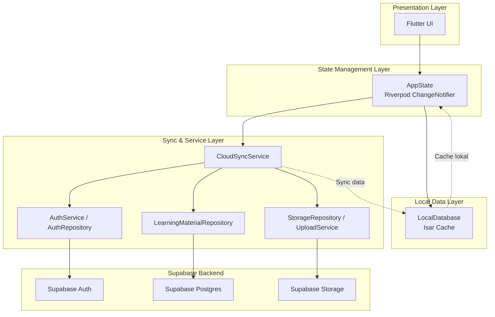

<p align="center">
   
<p>
<h1 align="center">
   Khoir Quets
</h1>


> Aplikasi Flutter pembelajaran anak bertema petualangan edukatif untuk membantu anak usia dini belajar sambil bermain, dengan pengalaman yang ramah anak, interaktif, dan tetap dapat dipakai secara offline.


## Ringkasan

Khoir Quest menyediakan pengalaman belajar anak usia dini dengan tampilan ramah anak, animasi, tema, badge, progress, materi bergambar, Iqra, serta lagu anak. Pengajar dapat mengelola konten dari dashboard pengajar dan menyinkronkannya ke Supabase agar materi tersedia untuk pengguna lain.

Target pengguna:

- **Anak / user biasa**: belajar huruf, angka, benda, Iqra, lagu anak, mengumpulkan bintang, badge, dan progress.
- **Pengajar**: mengelola materi, upload media, sinkronisasi cloud, dan memantau ringkasan konten.

## Fitur Utama

- **Auth online** via Supabase Auth dengan username internal berbasis email hash.
- **Role user**: `child` dan `teacher`.
- **Belajar Huruf A-Z** dengan gambar contoh dan progress kategori membaca.
- **Belajar Angka 1-10** dengan visual bilangan dan progress angka.
- **Belajar Benda** dengan kategori objek dan progress benda.
- **Belajar Iqra** dengan huruf hijaiyah dasar, bantuan latin, favorit, histori, dan streak.
- **Lagu Anak** dengan daftar lagu, durasi media, mini player animasi dari bawah, tombol play/pause, next/previous, repeat, dan progress playback.
- **Progress belajar** dihitung dari key materi yang valid dan unik agar nilai 100% konsisten.
- **Badge & achievement** untuk motivasi belajar.
- **Tema aplikasi** termasuk mode malam dan profil anak.
- **Dashboard Pengajar** untuk tambah/edit/hapus materi huruf, angka, benda, lagu, upload media, ringkasan konten, status sync, dan tombol sync manual.
- **Supabase Storage** bucket `learning-assets` untuk gambar/audio/video materi.
- **Local cache** memakai Isar/SharedPreferences agar data yang sudah disinkron tetap tersimpan di perangkat.

## Stack Teknologi

| Teknologi | Fungsi |
| --- | --- |
| Flutter | UI aplikasi multi-platform. |
| Dart | Bahasa utama aplikasi. |
| flutter_riverpod | State management. |
| go_router | Navigasi aplikasi. |
| Isar | Database lokal untuk akun, materi, progress, badge, histori, cache. |
| Shared Preferences | Preferensi ringan seperti onboarding dan tema. |
| Supabase Auth | Login/register akun. |
| Supabase Postgres | Profil, materi, dan histori belajar. |
| Supabase Storage | Upload media pembelajaran. |
| connectivity_plus | Deteksi koneksi untuk sinkronisasi. |
| file_picker / image_picker | Pilih media dari perangkat. |
| video_player / just_audio | Pemutar media lagu dan durasi. |
| flutter_animate / confetti | Animasi UI dan reward. |
| vosk_flutter | Dependensi pendukung mode suara. |

## Arsitektur Singkat



Prinsip utama:

- Aplikasi berjalan dengan akun Supabase aktif.
- Data materi ditarik dari cloud lalu disimpan ke cache lokal.
- Perubahan pengajar disimpan lokal, di-upload ke Supabase, lalu cache direfresh.
- Media lokal/asset yang diupload pengajar dikirim ke Supabase Storage dan disimpan sebagai public URL.
- RLS Supabase membatasi profil sendiri, histori sendiri, dan write materi hanya untuk teacher.

## Struktur Folder

```text
lib/
  core/
    config/              # konfigurasi Supabase
    constants/           # katalog default, identitas app
    utils/               # helper media, file, error mapper
  database/              # koleksi Isar dan service database
  models/                # model cloud/lokal
  repositories/          # repository auth, materi, storage, history, badge
  services/              # auth, sync cloud, upload, cache, migrasi, bootstrap
  src/                   # UI screen, app state, data, model part
  storage/               # local storage service
supabase/
  schema.sql             # tabel, trigger, RLS, bucket storage
  seed_learning_materials_basic.sql
  reset_password_by_username.sql
  repair_auth_emails.sql
assets/
  images/
  fonts/
```

## Setup Project

### 1. Install dependency

```bash
flutter pub get
```

### 2. Konfigurasi Supabase

Aplikasi membaca config via `String.fromEnvironment` di `lib/core/config/supabase_config.dart`.

Default project sudah ada di source, tapi untuk project lain jalankan dengan:

```bash
flutter run \
  --dart-define=SUPABASE_URL=https://PROJECT.supabase.co \
  --dart-define=SUPABASE_ANON_KEY=YOUR_ANON_KEY
```

Atau build web:

```bash
flutter build web \
  --dart-define=SUPABASE_URL=https://PROJECT.supabase.co \
  --dart-define=SUPABASE_ANON_KEY=YOUR_ANON_KEY
```

### 3. Setup database Supabase

Jalankan SQL berikut di Supabase SQL Editor:

1. `supabase/schema.sql`
2. `supabase/reset_password_by_username.sql` jika fitur reset password via username diperlukan
3. `supabase/seed_learning_materials_basic.sql` jika ingin seed materi awal ke cloud
4. `supabase/repair_auth_emails.sql` hanya bila perlu perbaikan akun lama

Schema utama membuat:

- extension `pgcrypto`
- table `profiles`
- table `learning_histories`
- table `learning_materials`
- trigger bootstrap profile dari `auth.users`
- trigger `updated_at`
- RLS policy untuk profil, histori, materi
- function `public.is_teacher()`
- storage bucket public `learning-assets`
- storage policy read public dan write teacher

### 4. Jalankan aplikasi

```bash
flutter run
```

Untuk web:

```bash
flutter run -d chrome
```

## Role dan Login

### Anak / Child

- Login/register sebagai user biasa.
- Mengakses menu belajar, lagu anak, badge, tema, profil, favorit, dan progress.
- Progress tersimpan ke profil Supabase saat sync berjalan.

### Pengajar / Teacher

Role teacher dikenali dari profil Supabase `profiles.role = 'teacher'`.

Username yang diawali `pengajar` atau `guru` juga dibootstrap sebagai teacher oleh trigger `handle_profile_bootstrap()`.

Pengajar dapat:

- membuka dashboard pengajar,
- menambah/mengedit materi benda dan lagu,
- mengganti gambar materi huruf dan angka,
- menghapus materi,
- upload gambar/audio/video ke `learning-assets`,
- melakukan sync manual dari topbar dashboard.

## Data Supabase

### `profiles`

Menyimpan identitas dan state user:

- `username`
- `role`
- `avatar_url`
- `child_name`
- `gender`
- `theme_id`
- `stars`
- `iqra_streak`
- `progress`
- mastered set per kategori
- favorite material ids

### `learning_materials`

Menyimpan metadata materi:

- `id`
- `category`: `huruf`, `angka`, `benda`, `iqra`, `lagu`
- `symbol`
- `label`
- `image_path`
- `audio_path`
- `video_path`
- `created_by`

### `learning_histories`

Menyimpan riwayat belajar user:

- `user_id`
- `material_id`
- `category`
- `duration`
- `score`
- `played_at`

### Storage `learning-assets`

Bucket public untuk media pembelajaran. Read bersifat public, write/update/delete hanya user authenticated dengan role teacher.

## Catatan Sinkronisasi

- Supabase SDK tidak boleh dipaksa memakai `Authorization: Bearer anonKey`; session user harus dikelola SDK agar `auth.uid()` terbaca oleh RLS.
- Dashboard pengajar auto-sync saat dibuka dan punya tombol sync manual.
- Jika sync gagal karena RLS, cek session login, `profiles.role`, dan pastikan `schema.sql` terbaru sudah dijalankan.
- Jika materi cloud kosong, cache lokal kategori ikut dikosongkan agar delete dari Supabase konsisten.

## Progress Belajar

Progress kategori dihitung dari item valid unik:

- `membaca`: huruf unik dari katalog aktif
- `angka`: angka unik dari katalog aktif
- `benda`: nama benda unik dari katalog aktif
- `iqra`: pasangan huruf/latin Iqra aktif

Key progress dinormalisasi uppercase agar `a`, `A`, dan spasi tidak membuat perhitungan meleset. Ini menjaga A-Z dan 1-10 mencapai 100% setelah semua item dibuka.

## Lagu Anak

Bagian lagu anak saat ini:

- menampilkan nama lagu dan durasi media,
- tidak menampilkan judul/file video di kartu,
- mini player hanya muncul setelah lagu dipilih,
- mini player muncul dengan animasi dari bawah ke atas,
- saat pause, player tetap terlihat,
- durasi dibaca dari controller video agar sesuai media.

## Perintah Berguna

```bash
flutter analyze
```

```bash
flutter test
```

```bash
dart format lib test
```

Regenerate Isar jika koleksi berubah:

```bash
dart run build_runner build --delete-conflicting-outputs
```

## Status

Aktif dikembangkan untuk kebutuhan aplikasi PAUD Sentrakreasi / Belajar Yuk.

Fokus saat ini:

- stabilisasi sync Supabase,
- dashboard pengajar online,
- konsistensi progress belajar,
- pemutaran lagu anak,
- penyempurnaan UX anak dan pengajar.

## License

Belum ditentukan.
